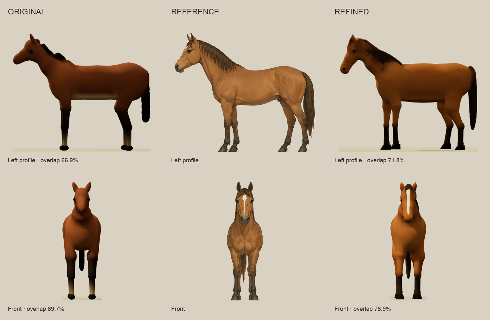
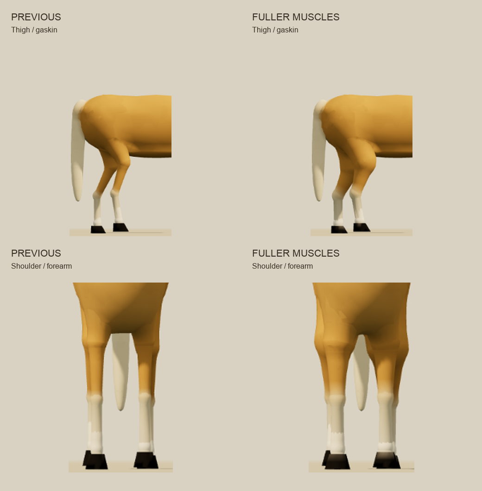
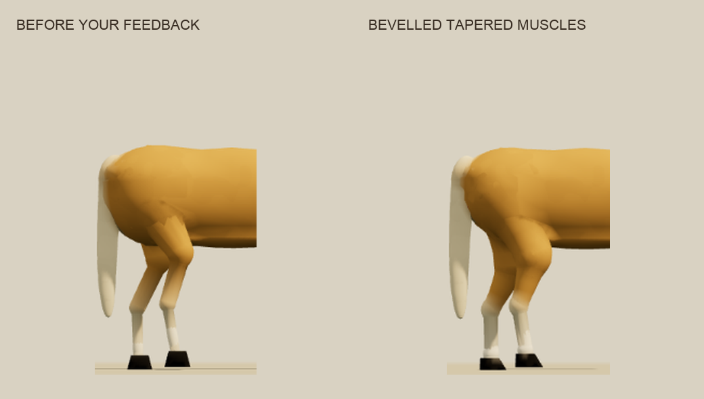

# Horse design review

The final horse incorporates the supplied bay model sheet, anatomy photographs and the user’s feedback. Passes 19–20 build more substantial shoulder, thigh and gaskin volume and thicker lower legs. The rump is smaller, while the shoulder and thigh muscles use circular tapered cylinders with rounded bevels. The broad ends blend into the torso and taper toward the joints, with no oval muscle shells on the upper legs. It also has a downward nasal bridge and fuller jaw, narrower stance, a lower and shorter barrel, a long tapered tail, a continuous mane fall, pointed ears, flat hoof soles, and a surface-painted blaze. The lab uses the same AnimalSystem and recipe as Wander, so these changes also apply to the game. Other horse coat variants remain available; the lab showcase uses the reference's bay coat and blaze.



| Orthographic view | Original | Refined | Change |
| --- | ---: | ---: | ---: |
| Left | 66.9% | 71.8% | +4.9 pp |
| Front | 69.7% | 78.9% | +9.2 pp |
| Back | 74.9% | 83.0% | +8.1 pp |
| Right | 60.1% | 67.5% | +7.4 pp |
| Mean | 67.9% | 75.3% | +7.4 pp |

These are silhouette intersection-over-union measurements, not ratings of artistic quality. Both final captures use **planted-pose-640-v2**, the same 640×640 renderer, lighting, ground, reference masks, and alignment. Reference height is normalized uniformly, then aligned to the hoof baseline and centre; there is no per-view manual fit or non-uniform stretching. The two supplied side drawings differ in width/height ratio by about 8%, so a single symmetric 3D model cannot exactly reproduce both. The remaining side-view mismatch and the illustration's fine hair/muscle detail are visible in the comparison. The added muscle volume raises mean overlap from 73.4% at pass 18 to 75.3%, with improved leg-region overlap in all four views. The closer fit supports the screenshot critique; it does not replace visual judgment.

The original and refined models both use 81 SDF shapes. The final bevels and extra rings at torso intersections increase triangle count from 22,824 to 23,526 (3.1% more). Each horse remains one mesh; the articulated bones, procedural IK and rope animation are retained.

## Review loop and research

The workflow draws on [Playwright's visual comparison guidance](https://playwright.dev/docs/test-snapshots), which stresses a consistent rendering environment, and [Huang, Xie and Fukusato's orthographic modeling research](https://arxiv.org/abs/2201.11284), which iterates on corresponding features across views. Here, screenshot critique and the fit measurements complement each other: a silhouette score cannot judge whether a mane reads as hair, a hoof has a flat sole, or a blaze looks painted onto skin.

1. Capture a fixed, planted pose from left, front, back, right, and three-quarter views.
2. Review model, reference overlay, and the cyan/red difference image. Name the visible issue before editing.
3. Change a related group of anatomy or surface parameters.
4. Capture again and inspect all views. Reject local improvements that damage overall form; retain useful surface changes even when overlap is unchanged.
5. Check walking/running, other coat variants, geometry budget, and regression tests before accepting a round.

## Iteration record

- Initial inspection found that the lab's horse reference files were absent. The first five passes improved mane/tail continuity, head carriage, eyes, nostrils and markings provisionally, with no reference score claimed.
- The supplied sheet was installed and calibrated. Ground rules, pale cast shadows and enclosed gaps between legs were removed from the masks; the pale facial blaze remains part of the head silhouette. Early reports are retained as working evidence but use evolving calibration and must not be treated as the final before/after comparison.
- Reference passes 6–7 restored more forward neck reach, lowered the barrel, opened the fore/aft stance, added flat sloping hoof walls, and tested draped mane shapes. Separate short mane locks were rejected because they formed lumps in screenshots.
- Pass 8 narrowed the stance seen from the front/back and replaced the locks with continuous overlapping falls. Average overlap reached 74.6% under the final mask calibration.
- Pass 9 shortened the body slightly and increased leg separation in side views. Average overlap reached 75.1%.
- Pass 10 kept a fuller cheek, pointed ear tips, inner-ear shading and a visible forelock, accepting a small silhouette-score reduction to 74.7% for the additional face definition. The final finish moved the dark leg points lower and made the showcase blaze visible.

- User feedback identified an oversized rump, underdeveloped upper-leg muscles, and oval forms that looked like spheres under the skin. Passes 11–13 explored smaller hindquarters and longer muscle masses; the oval approach was rejected.
- Passes 14–16 introduced a separate bevelled-frustum primitive with circular ends and straight tapering walls. Screenshot checks exposed a shape/pigment packing collision; the type stride was expanded to eight so the new primitive and coat colors decode correctly. These intermediate files are debugging evidence, not accepted results.
- Passes 17–18 inset the broad upper ends into the torso, added surface rings to smooth the intersections, shortened hinge overlap to remove cuffs, and rounded the bevels. The final rump recipe is 13% narrower, 17% shallower vertically and 12% shorter than pass 10. Upper muscles are broader at the root and narrow continuously toward the joints. Smaller, forward-sloped hooves and modest fetlocks replace the blocky foot transitions.

- Pass 19 used the newly supplied anatomy photographs to increase muscle volume along the thigh and gaskin, plus shoulder/forearm thickness. Lower-leg radii increase 23% in front and 22% behind. The hoof width increases 13% to suit the sturdier legs; hoof height and skeletal lengths remain the same.
- Pass 20 carries the upper muscle radius through the stifle/elbow into the lower taper, removing the abrupt reduction between the two segments. Upper taper root diameters grow 15% in front and 14% behind relative to pass 18; their joint ends grow 51% and 76% respectively. There are still 81 shapes and 23,526 triangles. This is the accepted version.



The three user-supplied anatomy references are retained as `anatomy-photo.png`, `stance-photo.png`, and `muscle-diagram.png`. They guide muscle volume and articulation; the original illustrated sheet remains the four-view measurement reference.



Only **before.json / after.json** and **before.png / after.png** are the final comparable results. The original source was temporarily restored for its capture, then the final implementation was restored. `10-before-hindquarter-feedback.*` preserves the earlier accepted pass. `after-palomino.png` shows the final geometry in the coat used in the user's feedback screenshot. The current accepted pass is 20. `18-before-muscle-volume-*` preserves the version before the latest anatomy-photo feedback.

## Reproduce

Run `python3 serve.py 8475` from the repository and open `http://127.0.0.1:8475/animal-lab.html?species=horse&view=left&mode=overlay`. The no-cache server is important: the basic Python HTTP server may serve cached ES modules between edits.

Use **capture five-view review** to generate a fixed 640px sheet and its JSON measurements. The capture plants authored foot contacts using the runtime IK solver, clears any prior animated pose, disables uneven ground and manual reference offsets, then restores the editing view. The buttons in the review dialog save the PNG and JSON. Horse muscle controls expose root and joint radius multipliers for the bevelled tapers; primitive mode shows the matching geometry. Arrow keys edit focused controls and only nudge the reference when a field is not focused. Overlay/difference modes support closer inspection; coat, blaze and sock controls support material review.

The original user-provided sheet is `assets/animal-references/horse-sheet.png`. To regenerate its four cropped alpha references with Python, Pillow and NumPy installed:

```sh
python3 scripts/build_animal_reference_assets.py --horse assets/animal-references/horse-sheet.png --output assets/animal-references
```

## Validation

- `npm test`: **607 passed, 0 failed, 7 existing TODOs** (614 total).
- The full suite was rerun after the muscle-volume and joint-transition changes; all 607 non-TODO tests passed. Taper controls preserve the selected coat and markings, and browser logs reported no rendering errors. A fox smoke check confirmed the shared shader still renders another species; its existing side-view framing clips the muzzle slightly.
- Final fixed-pose captures were byte-identical, including a repeat of the final palomino capture. Results and image hash are recorded in validation.json.
- Browser checks: walking on uneven ground at 1.31m/s and running at 8.53m/s; sampled IK error was 1cm at both speeds in the final check. Walking/running screenshots are saved here. No browser rendering errors were reported.
- The anatomy tail envelope was extended to 1.4m to cover the supplied sheet's full hair fall; the final tail is 1.312m. All limb lengths and gait timing remain unchanged.

Rebuild the comparison layouts from saved captures with `python3 docs/horse-design-review/make_comparisons.py` (Pillow required). Screenshot pixels are cropped and uniformly resized, with no retouching.
