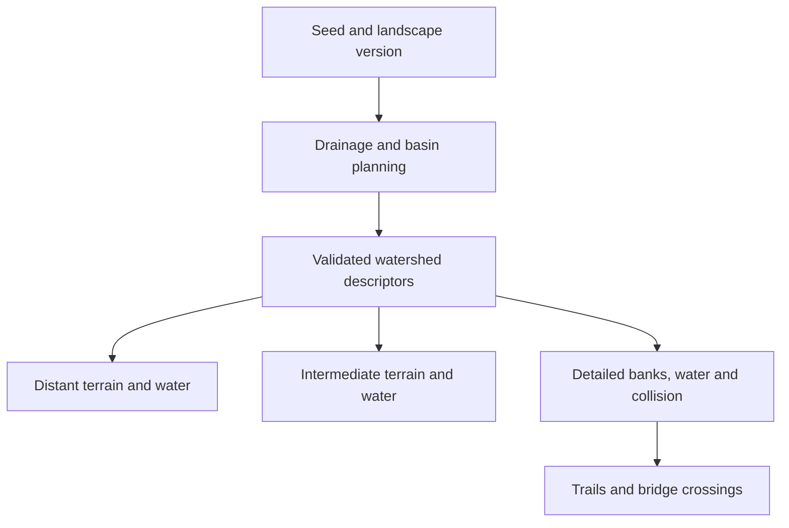

# Mountain-to-valley watersheds

Status: implementation begun. The first inspection fixture, descriptor adapter and distant-rendering prototype are in development; the production watershed/LOD rollout is not complete.

The follow-on proposal in `docs/river-hierarchy-and-transitions-plan.md` specifies the requested river-size hierarchy, rare ocean-connected trunk rivers, organic section profiles and natural lake contacts. It expands stages 3–4 below and carries their results through LOD, crossings and visual acceptance. It is a plan, not an implemented generation change.

## Implementation checkpoint — 2026-09-16

### Follow-up: cold generation and lossless packaging

- Independent candidate generation now uses up to three workers during startup, selected from available hardware concurrency. All 25 dependency regions, generation settings, canonical ownership resolution and validation remain intact. During walking, candidate generation retains its smaller serial CPU budget. Workers are lazy (no cache miss means no child workers) and disposed after the window is prepared.
- Persistent candidate reads and writes now batch bounded transactions while retaining corruption checks, LRU limits and denied-storage fallback. Diagnostic phase timings separate cache reads/validation, generation, cache writes, resolution and encoding.
- Seed 2, full game, local browser: **25.350 s cold** (25 misses; planning 18.772 s, scene preparation 6.258 s) and **10.147 s persisted reload** (25 hits). Both pass their respective limits in these runs. A separate run with overlapping CPU benchmarks took 43.615 s and failed; contention remains a practical limit, and this is not device-wide certification. Browser-restart acceptance is still unverified.
- Seed 4242, region (1,0), with the startup-only pool guard enabled: **22.418 s cold** (25 misses) and **8.616 s persisted reload** (25 hits). Both pass locally. These measurements run the full game through its rendered-scene readiness gate, not the faster inspection fixture.
- The compatibility descriptor has a versioned lossless dictionary/reference wire format. Browser measurement on seed 4242, region (1,0): **1,045,702 B → 912,639 B**, a **12.7% reduction**, with exact value round-trip. Existing unknown/partial topology is preserved. This improves transport/storage without making the descriptor the final compact many-region protocol.
- The inspection page provides an opt-in worker-based packing report under Measurements and coverage. Explicit region query parameters are now respected.
- Validation: the complete suite passed **781 tests**, with zero failures and six existing TODOs. Coverage includes numeric-exact real candidate worker output, out-of-order completion/canonical arbitration, queue limits, failure cleanup, cache corruption/eviction, malformed packed references and expansion limits. Startup-only scheduling also has a targeted stream regression assertion.

### Initial prototype baseline

- `watershed-lab.html` inspects accepted regional geography over real terrain tiles within a 4 km radius. It provides a survey view, a deterministic search for a dry-ground overlook with a clear sightline, a bank view and an explicitly labeled inspection flight. It does not claim a traversable descent route, detailed bank rendering or newly connected regional drainage.
- Distant terrain/water products are built in a cancellable worker, bounded by tile/byte limits and committed as a complete stage. The previous stage survives cancellation/failure. Shoreline refinement and terrain transitions remain prototype work, not a production LOD acceptance pass.
- `watersheddescriptor.mjs` adapts retained geography. Missing route topology is explicitly unknown; sparse mesh IDs do not justify inventing centerlines or inlet/outlet connections. The adapter is not yet the production generation or rendering source.
- `worldloadmetrics.mjs` separates inspection timing from full-game readiness. The game records readiness after terrain, collision, water and a rendered frame are available. Browser-restart cache acceptance remains separately unverified.
- Local seed 2 measurements: persisted full-game load **9.580 s** (25 persistent hits; passes the <15 s limit); isolated cold full-game load **51.755 s** (25 misses; fails the <=35 s limit). Cold water planning consumed **45.268 s**, and scene preparation **6.204 s**. These are individual development-machine observations, not a broad device/seed acceptance result.
- Stable cross-region drainage, production near/far transitions, bridge validation across the new geography, visual polish and the complete acceptance corpus remain outstanding.

The prototype's 32 m overview grid refines tiles containing accepted water hints to 8 m. This is sampling-based geometry, not an exact shoreline simplifier: small channels and islands below that tier still require constrained geometry. Neighboring terrain tiers also require production seam handling. The compatibility adapter retains bounded samples and extracted contours; its current payload is not yet the compact multi-region geographic protocol envisioned below.

Validation for this checkpoint: `npm test` completed with 766 passes, zero failures and six existing TODOs. Browser inspection confirmed terrain/water rendering in both fixture seeds, including a usable overlook in seed 2 and an explicit unavailable-overlook result in seed 4242. This does not certify walking, device performance, near/far transitions or browser-restart loading.

Cold-load optimization should first separate candidate generation, persistent-cache I/O, validation and wire encoding in the measurements. Batch equivalent IndexedDB reads/writes and reuse encoding before considering a bounded pool for independent region generation. Preserve canonical result order, the complete dependency window, validation and all candidate-quality settings.

## Intended experience

From a mountain or high ridge, the player can read the valley below: a main river, tributaries, lakes, occasional ponds, and their relationship to the land. They can choose a destination in that view, descend to it, cross its bridges, and find the same geography at ground level.

Distance changes rendering detail. It must not change a lake's outline or elevation, a river's course, or which waterways connect. Small ponds and narrow streams may naturally become subpixel at long range; larger water bodies and main channels must remain recognizable wherever terrain and atmospheric visibility allow.

The first complete acceptance scene should show a connected watershed spanning several current 4,096 m regions, with a walking route from an overlook to a lake inlet, a confluence and a working crossing. A second scene should exercise a different terrain type. Seed 2 remains a regression case, not the only showcase.

Loading time is a hard acceptance criterion: first-time generation must finish within **35 seconds**, and subsequent loads must finish in **less than 15 seconds**. These limits apply alongside the visual and frame-time requirements.

## Existing constraints and useful foundations

- `hydrologyregions.mjs` generates local candidates, limits each accepted object to its owner's region plus a 1,024 m halo, and resolves neighboring overlaps by dropping conflicting objects. That prevents duplicate water but does not establish a shared cross-region watershed.
- The regional planner retains nine detailed plans, generated from 25 surrounding candidate regions. Enlarging that detailed window would multiply preparation and memory costs.
- River source selection currently favors terrain between 1.5 and 35 m elevation. More sources alone will not provide convincing upland headwaters and long valley rivers.
- `rivernetwork.mjs`, `rivergraph.mjs` and `rivercomponent.mjs` already provide route merging, downhill constraints, shared junction levels and bank fitting. Preserve these checks and extend their scope.
- `riverBoundaryPortals()` already describes route intersections with region boundaries, but currently has only a test caller. It is a starting point, not an existing cross-region ownership protocol.
- Inland water meshes currently belong to streamed terrain chunks. `farterrain.js` provides a terrain surface to roughly 3 km, followed by skyline ribbons at 3, 5 and 7.5 km. Those ribbons are not a valley floor onto which distant lakes can simply be placed.
- The recent performance changes provide cooperative preparation, reusable worker payloads, atomic terrain handoff and incremental scenery refreshes. Keep these as requirements of the new path.

## Design decisions

### One geographic plan, several representations

Introduce compact, versioned watershed descriptors containing stable IDs, connections, river centerlines and width profiles, constrained water elevations, lake shorelines and holes, terrain influence, and cross-boundary contracts. A descriptor describes geography; it does not contain every high-resolution terrain cell or GPU vertex.

The same accepted descriptor produces distant water, intermediate water and terrain, nearby detailed meshes, collision samples and crossing candidates. No renderer invents its own river course or lake polygon.

### Geography must be stable before it is shown

A coarse drainage proposal is not sufficient evidence that a river can exist there. Before a watershed becomes visible, validate its shoreline and channel corridors, water levels, junctions, terrain support and allowable earthwork. Expensive decorative meshes can arrive later; basic feasibility cannot.

Near-detail generation must realize the accepted descriptor rather than reroute it. A validation failure should be detected before publication. A later implementation failure must retain the previous complete representation and expose a diagnostic, not quietly move or erase visible water.

### Geometry budgets control detail, not the existence of a river

Separate the geographic graph from tile-sized mesh products. A long river must not disappear because one monolithic connected mesh exceeds the current per-region byte limit. Partition geometry with shared boundary samples and levels; budget and evict those products independently.

Existing map positions need not be retained. All current crossing styles still need to be supported. Geography changes require a new generation/cache version and compatible save/multiplayer identities.

## Implementation sequence

### 1. Establish the overlook benchmark and descriptor contract

Build an inspection fixture with fixed overview, mid-slope and waterside camera positions, plus a repeatable descent route. Add switches for terrain/water detail tiers, boundary overlays and drainage IDs. Record visible water extents, active bytes, worker queues, frame intervals and GPU timing where available.

Define the compact descriptor schema and a compatibility adapter for existing accepted water plans. Specify shared boundary position, level, width, tangent, bank influence and ownership. Include lake holes/islands and unambiguous inlet/outlet junction ownership from the start.

Deliverable: a reproducible scene and tests that can distinguish missing distant water, mismatched geography, a terrain occlusion error and a streaming hitch. Instrument cold and subsequent startup times here, before expanding the generation footprint. Establish measurements before choosing final draw-distance or memory budgets.

### 2. Prove distant terrain and water together using existing geography

Use accepted existing plans to produce simplified lake surfaces and river strips. Replace or extend the skyline-only representation within the intended valley-view distance with actual coarse terrain tiles. Retain skyline ribbons only where a silhouette is sufficient.

The coarse terrain must respect the same water levels, shorelines and channel corridors. Add constrained terrain samples around water where uniform simplification would bury a river or expose its underside. Preserve shoreline islands, inlets, major bends and confluences during simplification. Use normal terrain depth testing so water behind a ridge remains hidden.

Start with a measurable 4–6 km valley view; treat a 10–12 km desktop view as a later benchmark target, not a promised universal distance. Camera clipping, fog, terrain coverage and water coverage must agree. Evaluate large world coordinates as well as the origin.

Deliverable: existing lakes and rivers remain visible from an elevated viewpoint after their detailed terrain chunks have unloaded. Their locations and levels match the nearby view. This is an early visual milestone, not completion of the larger-watershed work.

### 3. Build the cross-region drainage hierarchy

Prototype a coarse drainage graph above the current detail-region scale. Determine downstream receivers, catchments, depressions and lake spill points before placing tributaries and detailed shorelines. Use terrain suitability and contributing drainage area to distinguish headwaters, tributaries and main rivers; broaden headwater selection beyond the current low-elevation filter.

Give neighboring regions canonical boundary contracts derived from the shared parent plan. A region consumes those contracts instead of independently proposing a river and then deleting overlaps. Agree on a junction's water level once. Region edges never act as accidental river sources or sinks.

The prototype must resolve the difficult infinite-world dependency explicitly: visiting an upstream region later cannot enlarge or move an already visible downstream river. Use deterministic parent drainage plans and bounded dependency rules, with stable ties and shared ownership. Do not compute drainage area from whichever detail tiles happen to be loaded.

Natural closed basins are valid sinks. Budget exhaustion and an unloaded neighbor are not. Tests must distinguish a natural terminal from an unresolved continuation.

First try routing against the existing terrain model. If representative upland catchments cannot produce valid channels without excessive excavation, add a versioned, broad valley-shaping stage shared by all terrain detail levels. Treat that as an explicit generation change with its own landform checks; do not hide excessive cuts inside bank fitting or relax the existing anti-floating-water rules.

Deliverable: a deterministic, feasible river/lake graph crossing multiple regions, unchanged by generation order, cache eviction or approach direction. This is the main architectural risk and must pass before broad rollout.

### 4. Fit and partition detailed water systems

Adapt the existing river profile, basin, inlet, junction and bank solvers to the accepted drainage hierarchy. Preserve flat lake heads, downhill river profiles and shared confluence levels. Connect lakes through credible spill points, with multiple inlets where their catchments support them.

Partition connected systems into bounded render/sampling tiles. Keep one owner for each inlet, confluence and shoreline section. Shared tile edges must use identical samples; loading another tile must not independently solve a different water level.

Regenerate trail and bridge candidates against the new geography. Verify all current bridge styles, approach slopes, decks and collision. Bridge locations may change, but their placement must be stable for a seed and generation version and must not depend on the active rendering tier.

Deliverable: the distant watershed can be walked into, including through region boundaries, without changes in geography, duplicate surfaces, unsupported banks or broken crossings.

### 5. Separate visibility streaming from walking-detail streaming

Maintain separate bounded caches for compact geographic descriptors, distant/intermediate meshes and nearby detailed terrain. Camera visibility and projected feature size determine distant work; player position, direction and speed determine collision/detail prefetch. Turning on a mountain must not request full-resolution terrain for the entire view.

Use cancellable worker jobs, finite queues, stale-result rejection and incremental GPU uploads. Keep the previous complete tile until its replacement is ready. Quality settings can reduce detail and update cadence while preserving the same geographic plan.

Use overlapping detail bands and hysteresis to prevent repeated swaps at a threshold. Prefer depth-correct masks or dithered transitions to double transparent surfaces, which can darken water and create sorting artifacts. Terrain, shoreline and water representation changes must be coordinated.

Pin the visible geographic identities while evicting their expensive representations. Separate topology-cache revisions from render-product revisions where practical. Persist reusable validated plans and suitable render products so subsequent loads do not repeat cold generation. Report genuine generation/loading progress at first startup. Meet the 35-second/15-second loading limits through work scheduling, caching and efficient representations while retaining geographic and bank quality.

Deliverable: ascent, descent, sideways travel and repeated region-boundary crossings remain bounded in memory and do not reintroduce large preparation stalls.

### 6. Polish the view at each distance

- From the overlook: readable main channels, organic lake silhouettes, preserved islands and peninsulas, plausible tributary structure, atmospheric depth and restrained sun reflections.
- At intermediate distance: coherent shorelines, bank color and vegetation transitions, visible river bends, and continuous confluences without noisy sparkle.
- At ground level: retain bank support, reeds and shoreline detail, visible shallow water, appropriate flow direction, and stable bridge approaches.

Use a less expensive sky/reflection treatment for distant water rather than a separate planar reflection for each lake. Match color, roughness and lighting across tiers. Filter subpixel streams and specular highlights smoothly instead of inflating their geographic width to force visibility.

Tune water frequency by catchment area, rainfall/biome and available landforms. Preserve dry terrain and occasional isolated ponds. Measure lake area, main-channel length, tributary density and distance between encounters so that a few favorable screenshots cannot conceal sparse general coverage.

Deliverable: reviewed mountain-to-water sequences in several terrain types, daylight angles and visibility conditions, with no conspicuous geometric or material transition.

### 7. Validate, version and roll out

Run deterministic generation in reversed and randomized request order; evict caches and rebuild; compare boundary contracts, water levels, shoreline identity and descriptor hashes. Check connectivity and downhill flow separately from mesh correctness.

Exercise at least a dozen seeds with both water-rich and dry regions, including seed 2 and 4242. Cover coast-bound rivers, inland lake chains, isolated ponds, narrow valleys, broad basins and upland headwaters. Use overview images, closer comparisons and a repeatable descent route, not only top-down maps.

Profile preparation arrival, validation, terrain fitting, mesh upload, first draw and later scenery/navigation updates. Record p95/p99 frame intervals and worst frames while moving, rather than only average FPS or final swap time. Proposed engineering targets are a 1–2 ms discretionary streaming budget per frame on the reference desktop and no new water-streaming main-thread task over 16 ms; these require measurement and are not current guarantees. Set explicit CPU, GPU and memory limits for lower-power/XR profiles after the prototype.

### Loading-time acceptance protocol

- **Cold world: at most 35 seconds.** Measure a seed and generation version without a persistent world cache.
- **Subsequent loads: strictly below 15 seconds.** Measure the same world using its persisted cache, including page reloads and browser restarts. An in-memory-only cache does not satisfy this requirement.
- Measure end-to-end from navigation/app launch to a rendered, controllable scene with the starting terrain, water, banks and collision ready. Include worker startup, cache reads, validation, required asset/mesh uploads and the first usable draw; do not stop the timer at worker completion or hide unfinished required scenery behind a premature Ready label.
- Record both total time and stage timings, device/browser details, network conditions and cache state. Use the same documented reference conditions for comparisons, and validate each supported performance profile. Report individual runs and the worst observed result as well as percentiles; an acceptable average does not excuse an over-limit run.
- Test cache reuse after a browser restart, partially populated caches, invalidated/corrupt entries and a changed generation version. Actual regeneration after a cleared or invalidated world cache is a cold case and must still meet 35 seconds; ordinary repeated loads must not unnecessarily invalidate that cache.
- Keep progress accurate and responsive throughout. These startup allowances do not authorize pauses or repeated loading screens during ordinary walking between regions.

Treat these timing limits as release gates beginning with the first vertical slice. If a milestone exceeds them, optimize the measured critical path before adding more scope; do not resolve the overrun by silently removing required water, lowering bank quality or redefining readiness.

Version changed geography and persistent caches together. Test save scope, host/guest agreement and arrival into a streamed landscape. Keep an opt-in rollout until the mountain-to-valley acceptance scene, broader seed coverage and performance gates pass. Do not replace the default generation merely because one showcase looks good.

## Completion criteria

1. A connected watershed spanning multiple regions can be recognized from an elevated viewpoint, within the supported visibility range.
2. Descending to it preserves river courses, lake outlines, water levels, junctions and crossing identity.
3. Distant water is supported by matching terrain, is occluded by intervening land, and cannot float over a simplified valley floor.
4. Region boundaries and detail changes produce no missing reaches, shoreline cracks, duplicated water or abrupt relocation.
5. All existing crossing styles work with the new placement model.
6. Streaming memory remains bounded and measured frame-time targets pass on the reference profiles; the recent large-hitch regression stays fixed.
7. Broad seed and terrain coverage meets the agreed encounter targets without forcing water into unsuitable landscapes.
8. First-time world generation reaches a usable scene within 35 seconds; subsequent loads of the cached world reach it in less than 15 seconds, including after a browser restart.

## Recommended next implementation

Start with steps 1 and 2: establish the overlook/descent fixture and render existing accepted water over a real distant valley surface. In parallel once the descriptor contract is settled, prototype the bounded cross-region drainage hierarchy from step 3. Integrate the two only after both preserve geographic identity. Then complete detailed fitting, streaming integration and visual polish before expanding the rollout.
