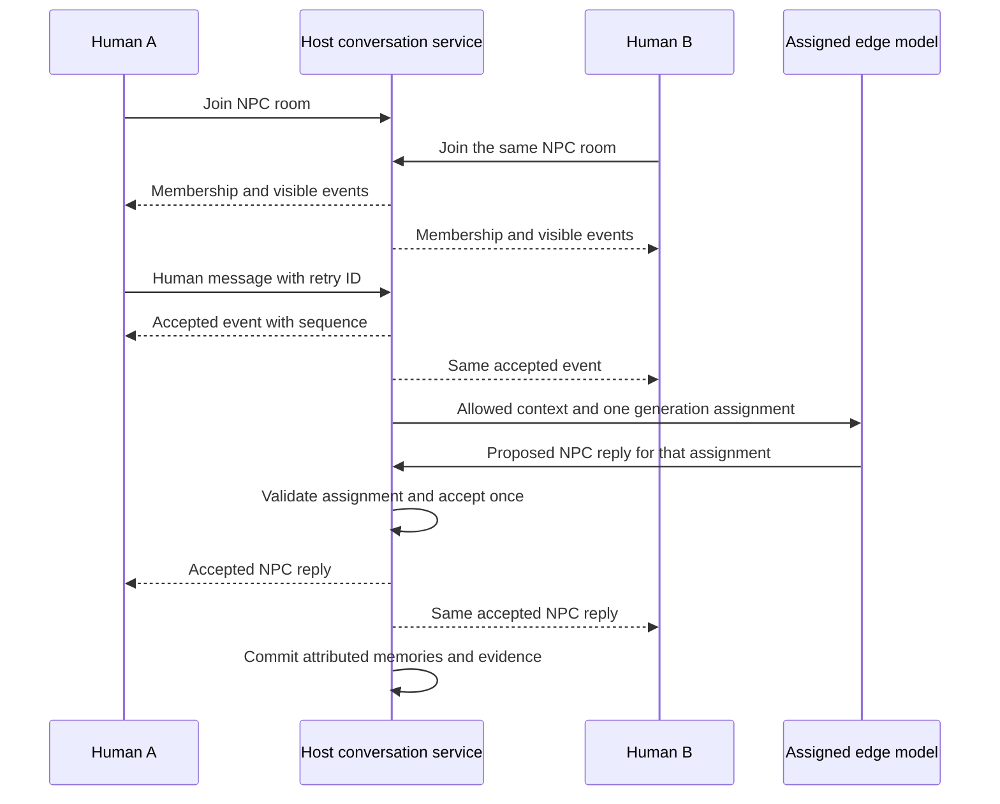

# Wander: human chat and shared NPC conversations

Status: first implementation delivered, 7 September 2026. The implementation
notes below distinguish the working feature from the remaining release gates.
This plan extends
[visitor conversations and lasting world memory](multiplayer-visitor-memory-plan.md)
and the original [shared-world plan](multiplayer-shared-world-plan.md).

## Implementation notes — 7 September 2026

Human invitations, nearby group joining, four humans plus one NPC, host-ordered
messages, per-speaker labels, participant departure, NPC generation assignments,
and host-owned conversation memory are implemented. The browser regression now
uses four independent Chrome contexts with real WebRTC channels and distinct
home seeds. It checks guest-to-guest human chat, common message order, group NPC
chat, the starter leaving, four durable participant receipts, and returning home.

Validation: `npm test` passed 607 tests with zero failures and seven existing
TODOs. The four-context `playtest:multiplayer` passed in Chrome using the bundled
Playwright runtime and deterministic NPC replies. Real edge-model behavior is
not established by that test.

The implementation uses `multiplayerconversation.mjs` for authority,
`multiplayerconversationui.mjs` for the panel and model delegate, and
`multiplayerconversationmemory.mjs` for canonical memory projection. The original
offline NPC panel remains the single-player path.

Persistence differs from the proposed IndexedDB migration: group memories now
live in `conversationMemories` inside the existing canonical world snapshot.
Memory, relationships, graph changes and receipts are staged together and saved
with one atomic localStorage write. A failed write rolls the staged changes back.
The memory reader consults this canonical branch before older per-NPC keys, so
there is no second independently committed memory key. Accepted room events are
journaled before acknowledgment and replayed after reload when projection has
not completed. Existing saves remain readable.

The following limits remain explicit:

- Real on-device model quality and activation still need a manual hardware
  playtest; the automated browser test substitutes deterministic NPC replies.
- Multiplayer group prompts use internal speaker IDs. UI profile names never
  enter them. Personal memory is withheld from multi-human prompts until a
  richer audience-aware disclosure policy exists. Solo returning visitors can
  still retrieve their own NPC memory.
- Direct introductions and each person's own statements persist separately.
  Accepted reports retain speaker, subject where unambiguous, witness IDs and
  event evidence. These become sourced social memories and eligible rumors;
  another person's reported promise never becomes the reporter's quest.
  Ambiguous model-generated player claims are excluded from propagation.
  Returning groups retrieve only evidence every current member witnessed.
- Rooms have a 200-event message budget. At the limit they ask players to close
  and begin another conversation, preserving accepted evidence instead of
  silently evicting it. Completed journals are removed only after every
  participant's effects are durable; uncommitted journals remain recoverable.
  An indefinitely long conversation is not included.
- Spatial validation checks distance, vertical separation, streamed structural
  walls and closed doors. Reconnected peers receive a fresh eligible snapshot.
  Cave-specific acoustic modeling is outside this text-chat implementation.

These notes do not mark every exit criterion of packages 0–5, or any original
shared-world phase, complete. The sections below retain the approved design as
the target for those remaining capabilities.

## Intended experience

Players can approach another human and start a text conversation using the same
interaction and panel style as NPC dialogue. A player can also approach an NPC
who is already talking with someone and join that conversation. Everyone in the
conversation sees an ordered transcript with identifiable speakers, and the
NPC can address individuals or the group.

The first release supports the existing session capacity: **the host and three
guests, with up to four humans and one NPC in a conversation**. Room membership
will support a list of participants rather than a fixed pair. Increasing the
network's player limit is a separate change.

Each human can participate in one conversation at a time. An NPC can belong to
one active conversation, which several humans can join. Different groups can
hold separate conversations with different NPCs simultaneously. Human-only
conversations do not require an LLM.

All humans have equal conversational abilities. The host's computer orders
messages and saves world consequences, but being the host does not confer
special status inside the conversation. The host need not attend a guest's
conversation. Existing session administration remains separate.

## Interaction decisions for review

These defaults were approved with the implementation request. Differences in
the first implementation are recorded above.

| Situation | Proposed behavior |
| --- | --- |
| Start talking to a human | Focus their avatar and press T to send a lightweight invitation. They accept before a panel opens or their movement controls change. Invitations expire after 15 seconds; simultaneous invitations between the same two players resolve to one conversation. |
| Join an NPC conversation | Approach and press T to join immediately. Existing participants see a join event. No approval is needed. |
| Join an existing human conversation | Approach a participant and choose Join conversation. Established groups are open to nearby players in this first release; private/invite-only rooms would be a later option. |
| Arrive during a discussion | See messages accepted after joining, plus the participant list and join notice. Earlier messages are not replayed to a new arrival. |
| NPC response timing | Respond after a short pause in human messages. Start with about 800 ms of quiet and a two-second maximum collection window; tune through playtesting. |
| Leave | Close/Escape leaves the conversation for that player. Others continue. Walking away or disconnecting removes only that participant. |
| Original starter leaves | The room continues while participants remain. If that device was generating NPC replies, generation transfers to an eligible remaining device. |
| No usable model | Human messages still work. Show that the NPC cannot currently respond and offer retry; do not block leaving. |

The initial invitation protects a human from having their controls captured by
another player's action. Joining an existing group is an explicit choice by
the newcomer. A human-only conversation does not automatically merge into an
NPC conversation; approaching an NPC offers an explicit switch of conversations.

Use the current NPC interaction distance as the starting join threshold. Add a
larger leave threshold and a short grace period to avoid oscillation at the
boundary. The host checks authoritative position, region/interior, and relevant
barriers; proximity must not allow joining from another floor or world. For
human groups, use a visible conversation location established when the invite
is accepted. Participants can move around it, but it does not form an unlimited
chain of distant players. Leaving the area eventually leaves the room.

The panel shows each human's display name, the NPC's name, a participant list,
join/leave notices, and separate pending/accepted message states. Messages from
the local player can be labeled “You.” Name changes update human-facing labels
without changing identity or what NPCs know. Human input stays available while
the NPC thinks. Accepting an invitation or joining must retain the game's
pointer-lock, focus, keyboard, and model user-gesture behavior.

Only explicit participants receive conversation text. There is no automatic
eavesdropping or world-wide chat in this release. Human-only chat does not create
NPC memories or rumors. Its transcript is temporary, with a short reconnect
grace period, rather than a new permanent chat archive. Messages pass through
the host; this is not end-to-end private messaging from the host's computer.

## What the current code requires

The implementation review used commit `d2be661` as its baseline. Existing
one-to-one dialogue is a useful foundation, but it is not a group conversation
service.

| Finding | Required change |
| --- | --- |
| `multiplayer.mjs` sends `profile-update`, `conversation-request`, and `conversation-response`, but `multiplayerprotocol.mjs` omits all three from its allowed message types. Calling `createEnvelope` rejects them. | Repair and test the real encoding/transport path before building group behavior. Existing service mocks do not establish that visitor dialogue works over peers. |
| `HostVisitorConversationService` reserves an NPC for one visitor and accepts alternating user/assistant transcripts. | Replace exclusive player ownership with an NPC room containing multiple members and host-ordered events. |
| `stationkeeper.js` combines a single NPC panel, model session, memory writes, and simulation reservations. Local host dialogue and visitor dialogue use different write paths. | Extract the conversation client/panel and route host and guest commands through the same authority service. |
| `main.js` uses a singular `dialoguePartnerId()` in simulation/mobility decisions. | Track every reserved NPC and apply per-NPC activity rules so two separate rooms both keep their NPCs engaged. |
| Memory extraction and narrative aliases assume one human speaker, including ambiguous references such as “you.” | Add speaker, subject, addressee, and listener identities to evidence and synthesis. |
| Profile display names can enter canonical entity names that social context reads. | Separate human UI profile fields from names learned by each NPC, and audit actual model context. |
| Checkpoints are in memory, final synthesis can be lost on departure, and memory/world saves are separate. | Add durable accepted-event recovery and transactional memory commits before claiming lasting group memory. |
| `LivingWorldAI` ends earlier chat sessions when creating a new one on a device. | Keep one active dialogue inference assignment per device initially; coordinate generation and synthesis jobs explicitly. |

The protocol rejection above was reproduced during planning and is repaired in
this implementation, with envelope-boundary regression coverage.

## Conversation authority and data flow

Use a **host-managed conversation room**, shared by human-only and NPC chats.
The host accepts membership and messages, assigns order, distributes the
transcript, and commits memory. Clients own presentation and submit commands.
One eligible device generates the NPC's proposed replies using host-provided
context. Every participant sees only replies accepted by the host.

Create a framework-independent room service and client adapter. The local host
uses an in-process adapter with the same validation and acknowledgments as a
guest. Single-player NPC dialogue uses the same service without networking.
The existing panel becomes a presentation layer rather than another authority
for accepted dialogue or saves.

Suggested module boundaries are `conversationservice.mjs`,
`conversationclient.mjs`, and `conversationui.mjs`; keep protocol validation and
group memory projection separately testable. Names can follow repository
conventions during implementation.

### Identity, membership, and transcript

- A room has a unique ID, world-history identity, host-session epoch, optional
  NPC ID, membership revision, current sequence, spatial anchor, and lifecycle
  state. A matching procedural seed alone does not identify a persistent world.
- Members use stable player IDs bound to admitted connections. Store join/leave
  sequence intervals, so reconnect and history filtering respect what each
  person was present for. Profile names and home-village metadata live outside
  the NPC prompt's learned-identity fields.
- An event has an immutable ID, host sequence, kind, speaker ID, content,
  audience, and optional explicit addressees. Human clients cannot submit an
  NPC role, another player's identity, or fabricated membership events.
- Commands cover invitation, acceptance, joining, saying something, leaving,
  resuming, and submitting an assigned NPC result. The host emits snapshots,
  accepted events, acknowledgments, and explicit rejection reasons.
- A client message ID makes retries idempotent. Reusing an ID with different
  text is rejected. Reordered packets, duplicate replies, and packets from a
  previous room, world, or host epoch cannot produce new events.
- Each client renders the host's order. Optimistic local text is visibly pending
  and reconciled with acceptance or rejection; it cannot silently become NPC
  memory before acceptance.

Use the existing reliable WebRTC channels and host relay, including guest-to-
guest delivery. Their bounded chunking already supports reliable control and
state messages; reuse it for context rather than inventing a second transport.
Validate reconstructed envelopes as well as incoming chunks. Enforce UTF-8 byte
budgets, queue limits, rate limits, and bounded room/context history. Small chat
commands should remain responsive during bulk world synchronization.

Advertise a group-conversation capability/version during admission. Mixed
clients receive a clear update-required result rather than partially joining
an incompatible room. Harden send/readiness errors and synchronous service
exceptions so every pending request settles or times out cleanly.

### One NPC voice, with several human speakers

The host grants one generation assignment at a time for each NPC room. Prefer
the initiating participant's ready edge model, preserving visitor-side
inference. If unavailable, choose a willing, capable participant. The host's
model is an option when the host is a participant. Initially, do not transfer
private room context to another player who is not in the room.

Assignments carry the room and host epoch, a generation ID, membership/context
revision, and the last included event sequence. Only the assigned connected
device may submit that result. The host accepts it once and broadcasts it.
An expired or superseded assignment cannot speak or commit effects.

Collect a short batch of human messages, then generate a reply to that batch.
Messages arriving during generation remain visible and queue for the next
batch. Ordinary typing does not repeatedly cancel generation and starve the
NPC. Membership changes, a departure of the generating device, or a relevant
context invalidation revoke the assignment and rebuild it safely. Keep one
reply in flight per NPC, allow a natural closing response, and avoid an endless
autonomous NPC loop when humans stop responding.

The model adapter supplies explicit speaker IDs and NPC-known labels for every
human utterance. Consecutive messages from different humans must survive prompt
compaction and runtime recovery; an alternating `user`/`assistant` history is
not sufficient. Treat quoted player text as dialogue data, not model commands.
Use stable addressees when selected; when reference is ambiguous the NPC can
ask who someone means rather than attributing a promise arbitrarily.

Start with complete, accepted NPC messages rather than streaming unaccepted
tokens. This makes all clients see the same reply and keeps memory evidence
stable. Typing/thinking indicators can be separate transient events.

Bound generation time and expose retry/fallback behavior. Transfer an
assignment when its device disconnects without closing the room. Do not run
two live rooms through one device's single active model session. Background
synthesis must queue safely or use a deterministic host fallback rather than
destroying an active conversation's model state.

### Context, names, and arrivals

Fetch bounded context from the host at the start and as relevant knowledge
changes. Build both a per-person view of what this NPC knows and a group view
of what may be disclosed to everyone currently present. A fact known to the NPC
is not automatically safe to transmit to a participant's computer.

Display names remain exclusive to human UI. An NPC initially distinguishes
people through stable internal identities and appropriate descriptions, then
learns spoken names and origins from attributable statements or sourced
rumors. A home station association helps identify the same traveller across
visits; neither matching village names nor matching display names merges two
players. Renaming a profile does not rewrite a spoken introduction.

Joining does not disclose earlier scrollback, private relationship records, or
secrets through the model context either. If generation transfers to a new
arrival, provide their eligible transcript and a host-produced summary limited
to information suitable for the current audience. Invalidate an in-flight
reply when audience changes, so a response prepared for one listener is not
accidentally delivered to a larger group. An NPC can refer to older events only
under the same disclosure rules as any other remembered fact.

Anything supplied to a participant's model is inspectable on that device.
Therefore the first release uses filtered, publishable context; a future need
to reason over undisclosed secrets requires a host-side model path. The host
can validate attribution and game rules, but cannot prove an arbitrary client
ran an untampered model. Physical effects and authoritative knowledge updates
remain constrained by host rules and accepted evidence.

## Lasting memory belongs to the host's world

Replace the one-human synthesis assumption with evidence about **speaker,
subject, addressee, and witnesses**. Each accepted utterance has a stable ID;
memory and narrative proposals cite those IDs and the relevant membership
intervals. A synthesis result cannot invent a speaker or make a late arrival
have witnessed an earlier exchange.

| Example | Intended memory |
| --- | --- |
| A says “My name is Rowan.” | This NPC learns a claimed name for A. B's UI display name has no effect. |
| B says “Rowan promised to bring bread.” | Record B's report about A, with B as the source; it is not evidence that A personally made a promise in this room. |
| A promises to help; B watches silently. | Attribute the promise and its relationship effect to A. B may be a witness, but does not inherit A's promise or relationship reward. |
| B joins after a secret was discussed. | B receives no earlier text or hidden-context replay. A future NPC disclosure requires its own valid disclosure decision. |
| A leaves while B keeps talking. | Commit A's accepted interactions; continue updating B's part of the encounter. |
| Both visitors leave and the host returns tomorrow. | The NPC remembers each visitor separately; eligible world facts can continue through existing rumor mechanics. |

Maintain NPC-wide knowledge separately from per-NPC/per-player encounters,
relationships, introductions, and summaries. One group encounter can reference
many participants without copying every human claim into every person's
memory. Count an encounter once per NPC/player/room, including brief reconnects;
periodic synthesis must not repeatedly increase relationship scores.

Extend narrative retrieval, fact validation, social memory, and graph projection
to understand these attributions. Preserve sources through rumors. Reject or
leave unresolved ambiguous subjects such as an unqualified “you” in a group.
The existing two-NPC rumor/conversation logic remains a separate mechanism;
do not force group membership into its pair-oriented identifiers.

Human-only text has no NPC listener and produces no NPC memory. Visitors keep
only temporary session data and pending-delivery receipts. All lasting NPC
effects are stored under the host's world-history identity, with no writes into
a visitor's home-world graph.

### Durable checkpoints and recovery

Persist accepted NPC-room events on the host during conversation, not only
after someone presses Close. Append an NPC-room event to the durable journal
before broadcasting its acceptance acknowledgment. If that write fails, leave
the message pending or explicitly reject it. Distinguish durable transcript
acceptance from completion of its memory projection in receipts and UI states.
Human-only rooms retain their explicitly temporary delivery contract.

Use a host-side IndexedDB transaction boundary for the conversation journal,
applied-event receipts, and the canonical memory/relationship/fact changes
that those events cause. Integrate the affected existing world-save paths with
this repository so a later simulation save cannot overwrite a conversation
commit. Import existing saves conservatively and retain a recoverable migration
checkpoint; migration must never adopt a visitor's temporary replica as their
home save.

Project safe provisional memories from accepted evidence as the conversation
progresses and when a participant leaves. Assigned edge synthesis can refine
those memories using only evidence it is authorized to receive. Host fallback
projection covers unavailable or departed delegates. Applying, refining, and
retrying a segment uses durable receipts so facts and relationship changes
happen once. Never send an unauthorized earlier transcript to a new delegate
just to finish synthesis.

After a host crash, replay acknowledged journal work before reporting memory
as settled. Save failure must not be silently reported as successful lasting
memory. Returning home or closing a panel does not discard host-accepted work.
Compact raw journal segments only after their effects and necessary evidence
references are durable; set storage limits and recovery behavior explicitly.

## Implementation work packages

These are the proposed sequence for this feature, not replacements for the six
phases in the original shared-world plan. Each package should leave a testable
result; release shared NPC chat only after memory and failure gates pass.

| Package | Work and likely files | Exit criterion |
| --- | --- | --- |
| 0. Repair the existing foundation | Fix allowed message types, request errors, readiness/retry behavior, and profile-to-NPC context leakage in `multiplayerprotocol.mjs`, `multiplayerpeer.mjs`, `multiplayer.mjs`, `main.js`, and social-context builders. Add real peer dialogue coverage. | Host/guest visitor chat and profile updates travel through actual envelope encoding and decoding; wire tests reject forged identity; captured NPC context excludes unlearned UI names. |
| 1. Room authority and transport | Implement room state, invitation/membership lifecycle, ordering, deduplication, capability checks, snapshots/resume, spatial checks, and host/local adapters. | Four connected humans can create, join, leave, and resume rooms with consistent accepted transcripts, including guest-to-guest relay. |
| 2. Human chat experience | Extract/reuse the NPC panel, add avatar targeting and invitations, speaker labels, participant list, pending states, and keyboard/focus handling. | Human-only conversations work without a model; no forced panel opening; leaving affects only that participant; single-player dialogue remains usable. |
| 3. Shared NPC dialogue | Replace exclusive visitor reservations, reserve all engaged NPCs, implement generation assignments, multi-speaker context, batching, audience filtering, and delegate failover in the AI adapter. | Four humans hear one NPC voice; another player can join mid-chat; two separate NPC rooms do not interfere; starter departure does not end the remaining group's chat. |
| 4. Attributed, durable world memory | Implement the transactional repository and group-aware projection, retrieval, synthesis, evidence validation, encounters, and rumor integration across memory/narrative modules. | After departure and host reload, the NPC remembers each person's own interactions without duplicates or home-world contamination; interrupted synthesis recovers. |
| 5. Full-session validation and release | Extend browser multiplayer playtests, failure coverage, diagnostics, and protocol/asset version rollout. Complete manual local-model playtests. | The acceptance matrix below passes on the supported four-human session; older clients fail clearly; no silent memory loss or identity/history leakage. |

Packages 0–1 primarily extend original phase 1; shared NPC presentation and
activity also extend phase 3; durable memory extends phase 5; failure and rollout
work extends phase 6. This plan does not declare any original phase complete
or include unfinished shared-world interaction features by implication.

## Validation and release gates

Extend `scripts/playtest-multiplayer.mjs` to four isolated browser contexts with
distinct player identities and home seeds. Exercise real peer channels, envelope
validation, room UI, and save reloads. Use deterministic model output for
repeatable failure tests, then perform a separate real edge-model playtest for
speaker handling, response timing, context limits, and runtime activation.

- Exercise host-initiated, guest-initiated, guest-to-guest, and three-guest NPC
  chats while the host is elsewhere. Verify common event order and eligible
  history on every browser. Test four humans plus one NPC and two separate
  NPC rooms at once.
- Join while the NPC is generating; send simultaneous messages; leave as the
  starter or generating device; rejoin; walk out of range; cross an interior
  boundary; disconnect abruptly; and suspend the host tab. No duplicate NPC
  reply, stranded reservation, or forced termination of remaining members.
- Retry after a lost acknowledgment, reorder delivery, replay old epochs,
  submit another speaker ID, reuse IDs with altered content, exceed byte/queue
  limits, and send long Unicode messages. Run conversations beyond the current
  18-message checkpoint limit and across transcript/context compaction.
- Have two players use the same display name and then rename one. Inspect
  actual prompt payloads, graph entities, and stored memories. NPCs must learn
  only attributable introductions; one player's promises, rumors, encounter
  counts, and relationship changes must not transfer to another.
- Test pre-join text and restricted context with a late arrival and generation
  transfer. Verify human-only chat never enters NPC memories. Verify recipient
  filtering through reconnection, snapshots, and diagnostics as well as the UI.
- Crash/reload around event persistence, memory commit, receipt delivery, and
  migration. Simulate storage failure and synthesis timeout. Verify the host
  recovers accepted work once, and that a guest's original home save is unchanged.
- Regress offline NPC dialogue, movement and pointer lock, settings renames,
  NPC duty/mobility after room closure, returning home, and world synchronization
  under chat load. Measure acknowledgment latency, queue growth, and model
  latency separately; do not promise model timing independent of hardware.

Diagnostics should identify room/epoch, member count, event acknowledgment lag,
current generation assignment, and pending memory receipts without logging raw
private transcript text by default. Bound inactive room lifetime, invitations,
reconnect buffers, and context packets, and release NPC/model reservations on
every exit path.

Roll out behind a conversation capability/feature gate until all packages pass.
Start new sessions on the new protocol rather than migrating an active old
one-to-one chat in place. Update runtime asset versions together so cached
clients cannot silently mix conversation protocols. Retain a rollback path for
game code and compatible saves.

## Outside this release

Voice chat, global chat, multiple NPCs in one room, private-room permissions,
cross-session human message archives, more than four human players, host
migration, and worlds running while the host is offline are separate features.
This work does not by itself finish terrain, wildlife, object-interaction, or
other incomplete phases of the original shared-world plan.
