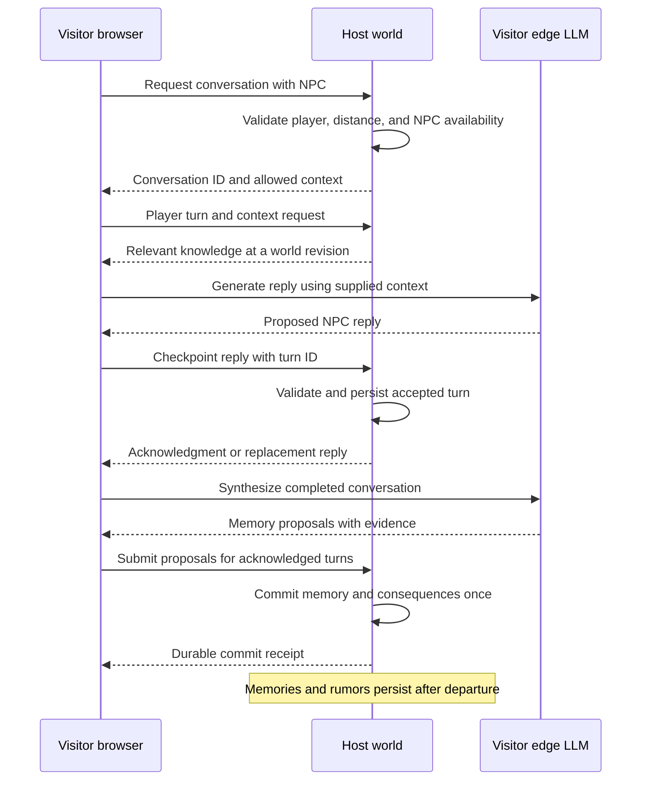

# Wander: visitor conversations and lasting world memory

Status: first vertical slice implemented on 5 September 2026. First-play names,
live human avatar labels, persistent home-station origins, visitor-side edge
dialogue, host-supplied NPC context, transcript checkpoints, per-player NPC
memory, relationships, narrative proposals, and rumor-ready visit records are
wired through the live runtime. The host validates proximity and transcript
identity and rebuilds durable memory from the accepted transcript.

This delivers the first milestone at the end of this document. IndexedDB atomic
transactions, per-turn retrieval refresh, full interaction parity, four-player
failure testing, and the broader phase acceptance matrices remain. It advances
phases 1, 3, and 5 but does not complete any entire original phase by itself.

## Agreed behavior

- A visitor is an equal participant in gameplay: the same supported interactions
  and consequences are available to visitors and the host.
- On first play, each player chooses a persistent display name, editable at any
  time through settings. Other human players see that name above the player's
  avatar during multiplayer, including host-to-guest and guest-to-guest views.
- The overhead name is interface information for humans. NPCs cannot read it
  and learn a player's name only through dialogue or a sourced rumor. Changing
  a display name never silently changes an NPC's memory of that person.
- Each player has a persistent association with a real station village in their
  home world. This travels with them when visiting: for example, “the traveller
  from Rivermore,” or “Tim from Rivermore” once their name is known.
- NPCs who meet a visitor remember that particular person. Other NPCs can learn
  about the visitor through witnessed events and actual conversations/rumors.
- The host's computer owns the lasting NPC memories, relationships, facts, and
  world consequences. They remain after the visitor leaves and after the host
  closes and later reopens the game.
- The visitor's own edge LLM generates their NPC conversation and synthesizes
  memory, using context retrieved from the host as needed.
- Visiting does not add another world to the visitor's home knowledge graph.
  Temporary conversation data and delivery receipts are separate from home
  world state. This supersedes the earlier idea of permanent visited-world
  graph branches on the visitor's computer.
- Rumors and consequences continue while the host runs the world, including
  sessions with no visitors. They do not require the visitor to remain online.
  Running a world while its host's game is closed remains outside this scope.

## Recommended architecture

Use the proposed split: **host-owned memory, visitor-run inference**. The host
supplies a small conversation-specific context packet, the visitor runs the
edge model, and the host validates and commits the resulting proposals.

The main adjustment is to send transcript checkpoints during the conversation,
instead of sending everything only after it ends. The host can then remember
the acknowledged part of an interrupted conversation even if the visitor
disconnects before synthesis finishes.

The knowledge graph is already derived from canonical state in
`npcnarrativegraph.mjs`. Persist the underlying entities, memories, relationships,
facts, and receipts on the host; rebuild the graph when required. Sending and
merging whole graphs would introduce unnecessary conflicts.

There are two limits to this design. Anything sent to a visitor's model can be
inspected on that computer, so context must exclude undisclosed NPC secrets and
raw private relationship records. Also, the host cannot prove that arbitrary
text was produced by an untampered visitor LLM. Treat this as cooperative
delegated dialogue: constrain what returned text can change, and keep physical
world outcomes under deterministic host rules. Evidence checks establish
consistency with the accepted transcript, not proof of model execution.

## Current gaps the implementation must fix

| Area | Observed code and implication |
| --- | --- |
| Visitor Talk | `main.js` supplies `active: false` for guest population updates; `stationkeeper.js` uses `active` both to allow Talk and to close dialogue. Interaction availability needs its own control separate from simulation authority. |
| Player identity | `npcnarrativefacts.mjs`, `npcnarrativecontinuity.mjs`, the synthesis prompt in `livingworld.mjs`, and the graph snapshot still use `player:local` as a single traveller subject. They need the actual conversation participant ID. |
| Player display names | `multiplayeridentity.mjs` already stores a display name and exposes an update helper, but the main UI does not expose name creation/editing. Avatar labels are created from connection metadata; existing avatars need an explicit rename path and peer metadata updates. |
| Memory scope | `NpcMemoryStore` keys memories by seed/NPC; meeting counts, player facts, and the last conversation summary are not per visitor. Encounter counters have the same problem. |
| Conversation writes | `talk()`, `sendMessage()`, and `completeDialogueClose()` read and mutate the local state/store. Visitor chat currently has no host conversation service. |
| Delayed synthesis | `completeDialogueClose()` drops a synthesis result after a region generation change. Returning home must not discard a host-bound completed conversation or write it into the newly active home state. |
| Durable commit | NPC memory and world state are separate localStorage writes; memory saves can silently fail. An in-memory intent receipt does not prove a host save succeeded. |
| Knowledge retrieval | The generic public world projection lacks the specific NPC's knowledge of the visiting player. Existing retrieval can also allow shared knowledge through relationships without recording an actual rumor transfer. |
| Existing building blocks | `npcrumor.mjs` already has conversation IDs, relationship outcomes, source chains, trust/cooldown rules, and transfer deduplication. Narrative fact proposals already have evidence validation and receipts. Extend these paths. |

## Implementation work, in dependency order

These are work packages within the existing six-phase plan, not a replacement
phase numbering scheme. Finish and verify each package before calling it done.

### Identity, memory ownership, and the host save boundary

Introduce a persistent world identity containing the owner, region ID, and a
world-history ID. The history ID survives reloads but changes on an intentional
new-world reset. Keep the connection's session epoch separate: reconnecting
must not reset NPC memory, and a reset must not replay an old conversation.

Use the existing stable `playerId` for each participant. A name change does not
create a new person. Keep departed visitor records in the host's entity registry
while releasing their live avatar and connection. No single global player ID
may be temporarily swapped when serving another player's conversation.

#### Player naming and human-only avatar labels

Add a name field to the first-play flow and a matching editable field in the
existing Controls & settings menu. Require a chosen, nonblank name before the
first Begin, Host, or Join action, including automatic hosting from a saved
preference. Persist an explicit naming-completed marker with the identity so
returning users are not repeatedly prompted. Preserve existing custom names;
players still using the old automatic “Traveller” default choose a name once.
An intentionally chosen “Traveller” is valid once confirmed by the player.

Reuse the existing display-name sanitizer and 28-character limit, validate
after trimming/sanitizing, and explain invalid input inline. Names need not be
globally unique. Saving a change preserves `playerId`, home-world identity,
origin village, relationships, and previous conversations. Editing remains
available while visiting another world as well as in the home world.

Add a reliable, revisioned profile update to the admitted peer session. The
host validates and forwards a visitor's own name change to other connected
players, and publishes its own changes through the same path. Update cached
admission names, human-facing player lists/departure metadata, and existing
overhead label textures without recreating the avatar or losing its motion
history. A late join or reconnect receives the newest profile; stale profile
updates must not restore an older label. Never accept one peer renaming another.

Keep three concepts separate:

| Field | Purpose and access |
| --- | --- |
| Stable `playerId` | Internal identity for graph references and deduplication; it survives renames. |
| Profile `displayName` | Human-facing UI, including the overhead avatar marker and owner-facing graph inspection. Not an automatic NPC fact. |
| NPC's learned name for a player | A per-NPC belief acquired through dialogue or rumor, with provenance and a player subject ID. Used for greetings, memory, retrieval, and spoken references. |

Build model context and entity aliases from the speaking NPC's learned names.
Filter display names out of generated player profiles, greetings, fallback
dialogue, retrieved entity titles, relationship descriptions, and rumor/source
labels unless that NPC has learned the name in-world. Do not rely only on a
prompt telling the LLM to ignore a display name that is present elsewhere in
its context. Apply this rule equally to the host and visitors.

An introduction can teach an NPC a name different from the overhead label.
Treat that as the name the player supplied, with attribution; do not “correct”
it using UI metadata. An NPC who met the player before learning a name can
still remember the meeting. Learning or correcting the name enriches that same
player node rather than creating a new one. A settings rename changes human
labels immediately; NPCs retain the previously learned name until conversation
or a rumor updates their knowledge.

#### Persistent home station village

Persist a home-village association on the player's home-world profile after
the canonical railway and its station villages have been generated. Use the
home starting station's village as the default, resolved through the existing
`stationsettlement.mjs` mapping. Store the selection once; walking elsewhere,
departing from another station, reloading, or visiting another world must not
reassign it. A temporary seed override must not replace the saved home origin.

The origin descriptor contains the home owner ID, region ID, world-history ID,
station ID, settlement ID, and village display name. The village must come from
the actual generated home world, not a model-generated place name. Existing
players receive this association when their home station plan is first ready;
an unresolved origin stays unknown until then. It must never be inferred from
the village they happen to be visiting.

Carry the descriptor in the approved visitor identity exchange and conversation
context. In a visited world's graph, keep one player node keyed by `playerId`
and link it to an origin-village node keyed by its home world identity and
settlement ID. That origin is a reference to a place outside the visited world;
it does not create a local settlement, populate its residents, or copy its graph.
Keep human-facing profile labels separate from each NPC's known aliases for
those same nodes.

"The traveller from Rivermore," "Tim," and "Tim from Rivermore" therefore resolve
to the same known player when the evidence is unambiguous. A village label is
not a unique person ID: two different worlds can both contain a Rivermore, and
two people can share an origin. Resolve conversation pronouns from the actual
participant ID and retain ambiguity for names/origins that match several people.
Repeated visits upsert the existing player and origin nodes rather than creating
a new traveller node for each phrasing, conversation, or visit.

The NPC learns the visitor's origin through an introduction or a sourced rumor;
the identity metadata does not grant every NPC knowledge of the visitor. Include
the learned origin in greetings, recall, and rumor wording, with the player ID
preserved throughout the source chain. The host graph viewer can display the
origin association directly. Renaming a village updates its human-facing label
without replacing the village node or silently changing an NPC's learned place
name. An intentional home-world reset can create a new origin
association for the same player, preserving dated previous origins and memories.

Split NPC memory into:

- NPC-wide knowledge about its own life and the world, with provenance.
- Per-person memory keyed by `(worldHistoryId, npcId, playerId)`: meetings,
  remembered name, relationship, player facts, and last conversation summary.
- Social memories with explicit subject IDs, original events, speakers,
  witnesses, confidence, and privacy, eligible for controlled propagation.

Thread explicit participant IDs through graph construction, pronoun resolution,
retrieval, synthesis prompts, fact validation, social outcomes, and the viewer.
The word “you” means the current interlocutor. Other players mentioned by name
remain separate subjects; ambiguous names must remain ambiguous.

Introduce a host repository for atomic persistence, preferably IndexedDB. Store
the canonical world checkpoint, per-person memories, pending conversations,
and commit receipts under one world namespace. All canonical save paths must
use it, including NPC simulation, chat close, clear/reset, unload, and rumor
exchange. A browser storage failure must return a failed save, not success.

Import existing home-world saves and memory once, associating proven old
single-player memories with their owner. Retain ambiguous records as legacy
history instead of assigning them to a visiting player. Preserve the original
save keys for recovery and explicitly prevent old code from silently replacing
the new canonical store after migration.

**Acceptance:** host, visitor A, and visitor B have distinct memories with the
same NPC; identical seeds in different owned worlds do not collide; reload and
rename preserve identity; “the traveller from Rivermore” and that visitor's name
resolve to one player without conflating other players or same-named villages;
no guest path writes a canonical visited-world save or changes the guest's home
graph. The home-origin profile is assigned locally in the home world. A first-time
player chooses a name; every other player sees it above their avatar; changing it
in settings updates those labels during the session. NPCs never learn that name
from the marker/profile and retain only the names they learned through dialogue
or rumor, even after a settings rename.

### Host conversation service and visitor edge-model client

Add a host service independent of the local dialogue panel. Suggested modules:
`multiplayerconversation.mjs` for conversation ownership/lifecycle and
`npcconversationcontext.mjs` for pure context construction. Refactor
`stationkeeper.js` into dialogue presentation plus a conversation client;
the host player uses a local adapter to the same service as visitors.

Opening a conversation validates the admitted connection, NPC existence,
proximity, and current availability. The host allocates a conversation ID and
an expiring reservation on that NPC. One player speaks to an NPC at a time;
other players see that it is occupied. Different NPCs can hold simultaneous
conversations. The reservation must feed journeys, settlement routines, station
duty, and streaming so the NPC does not walk away or lose its body mid-chat.

Separate `canInteract`, `simulate`, and `canPersist` throughout this path.
Replicated NPCs need the same Talk capability and stable identity as canonical
NPCs, including bodies materialized from a public snapshot. Merely enabling
Talk on the current guest ledger is insufficient.

Each opening or turn request gets a bounded context packet containing NPC
identity/personality, shared time/place, that NPC's prior encounters with this
player, qualitative relationship cues, allowed known facts, grounded interaction
targets, and a context revision. Build it on the host with the visitor's
position and identity, not the host player's local controls or active NPC.

Run `LivingWorldDirector`/`LivingWorldAI` on the speaking player's browser.
Fetch new host context for relevant turns, using the existing two-hop/eight-fact
retrieval as a starting bound. Reuse context when its dependencies are unchanged;
do not reject a dialogue because an unrelated NPC moved and changed the global
world revision. Preserve the existing user-gesture initialization and authored
fallback when the local edge model is unavailable.

Apply two filters to retrieval: what the NPC knows, then what it may disclose to
this interlocutor. Do not transmit raw `consistencyOnly` private facts merely
because the local model could use them. Use safe behavioral cues or host-side
reply checks for hidden constraints. A world-level public fact must not silently
give every NPC knowledge of a visitor's conversation.

**Acceptance:** a visitor chats using their own model, retrieves the host NPC's
memory of the correct player, and keeps the conversation open while guest
simulation stays disabled; two players cannot claim the same NPC; model failure
still produces grounded dialogue and a remembered encounter.

### Checkpoints, synthesis proposals, and durable host commits

Add versioned reliable requests/results for conversation open, context/turn,
reply checkpoint, keepalive/close, memory proposal, and receipt lookup. Each
includes world identity, session epoch, conversation ID, request ID, and turn
sequence. Derive the requesting player from the connection. Keep payloads
within the existing 16 KiB message ceiling, chunk larger bounded packets, and
prioritize dialogue control traffic ahead of world-update backlogs.

The host journals accepted player turns and NPC replies. Exact retries return
the same receipt; the same ID with different contents is refused. Reply
validation checks the active reservation, expected turn, allowed targets,
payload bounds, and contradictions with authoritative game state. Accepted
dialogue is what the user sees as the final NPC reply. While validation is
pending, show the existing thinking state rather than promising a world action
that may be rejected. Use a grounded authored response if a reply is invalid.

On close, the host commits a deterministic provisional memory from acknowledged
turns and records the encounter outcome once. The visitor synthesizes that
frozen transcript locally and submits incremental proposals referencing stable
turn IDs and exact evidence. Do not rely on indices in the UI's trimmed
18-message history as permanent evidence IDs; segment long conversations and
retain the referenced excerpts with receipts.

The host checks proposals against its own journal, participant identities,
allowed fact fields, and current state. It assigns IDs, knowledge holders,
confidence/privacy limits, event times, and relationship effects. Apply accepted
proposals as a transaction alongside their durable receipts. Send a “saved”
receipt only after that transaction succeeds, then update public world state.
Never replace an NPC's full memory with the visitor's stale synthesized copy.

Model-generated beliefs and supported gameplay events have different rules:
“the visitor said they delivered a letter” is a reported claim; a completed
delivery requires the actual host-owned delivery event. Dialogue cannot grant
inventory, rewrite another player's identity, or complete arbitrary quests.
The same restrictions apply to the host's own edge model.

Bind synthesis jobs to the conversation's original world and participant rather
than the renderer's current region. Returning home can release the visit while
already accepted turns remain safely stored on the host. If refinement arrives
late, merge it once against current memory without overwriting a newer last
meeting or repeating relationship rewards.

**Acceptance:** disconnect before synthesis still leaves a memory of acknowledged
turns; a lost acknowledgment/retry/host reload never duplicates a meeting or
consequence; a failed save never produces a durable acknowledgment; late results
cannot affect another world or overwrite a newer conversation.

### Lasting knowledge and rumor propagation

Turn accepted conversations and observed actions into canonical social memories
owned initially by the participating/witnessing NPCs. Use stable player subject
IDs and preserve the distinction between “I met them,” “they told me,” and
“someone told me about them.” Hearing a rumor does not increase the listener's
direct meeting count.

Bridge eligible narrative facts into the existing rumor exchange. On an actual
transfer, update both the listener's social memory and the fact's knowledge
holders in the same host transaction. Retrieval must honor those records:
trust makes sharing possible but is not itself evidence that sharing occurred.
Private information remains private, and existing trust, relevance, cooldown,
hop, and tone rules continue to govern what spreads. A rumor need not reach
every NPC.

Keep departed visitors addressable by memory, relationships, commitments, and
rumors while the host continues playing. Persist meaningful relationships and
encounters; bounded summarization may compress old dialogue without erasing
the fact of a meeting, unresolved promises, or the provenance of lasting impact.

Extend `npcnarrativesnapshot.mjs` and the graph viewer with individual visitor
nodes, each linked to NPC memories, beliefs, consequences, and rumor chains.
This is a branch in the host's graph. No visited-world branch is added to the
visitor's home graph, and the host's full graph viewer is not sent to guests.

**Acceptance:** NPC A remembers meeting a visitor, NPC B initially does not, and
B later learns a sourced memory only after a qualifying exchange. Both states
survive a host restart and the visitor's next arrival without changing the
visitor's home graph.

### Equal gameplay interaction and lifecycle integration

Audit the existing player interaction handlers: conversation/response/decline,
NPC commitments and their delivery/trade/visit/repair outcomes, markers, doors,
mounting, train boarding/seats/alighting, and any other currently playable world
changes. Record which are reachable gameplay versus debug-only machinery. Do
not turn unused data structures into invented gameplay to fill an inventory.

Route every supported player action through typed host commands with an
explicit acting player. Both host and visitors use the same eligibility,
ownership, distance, availability, conflict, and outcome rules. Host-only
administration such as closing the world remains separate from gameplay parity;
ordinary visitor actions do not need extra host confirmation dialogs.

Connect resulting events to witnessing NPC memories and commitments, rather
than depending on the player describing the action in chat. Mounts and seats
need exclusive ownership plus cleanup on departure. Preserve player-specific
holdings within the visited world without merging them into the home world.

During a network gap, suspend new authoritative interactions, release abandoned
NPC reservations after a grace period, and offer return home. Checkpointed
conversations can be finalized from the host journal without the visitor. After
host reload, resume or query a known receipt through a fresh admitted session;
old-session packets are never applied directly. Validate world-history identity
before recovering pending work.

**Acceptance:** the same supported action produces the same kind of consequence
for host and guest, attributed to the actor who performed it. Competing actions
resolve once, disconnects free reservations, and the remembered effects remain
when all visitors have left.

### Verification and release

Extend the existing full-browser harness with deterministic model adapters for
reproducible assertions, plus a manual native-edge-model smoke test. Test one
host and three guests, including simultaneous conversations with different
NPCs and competing requests for the same NPC. The decisive regression is:

1. A visitor chooses a display name and joins from their home station village.
   Other players see the chosen name overhead. NPC A starts without knowledge
   of that name and learns the visitor's name, origin (for example Rivermore),
   and purpose through conversation.
2. Another visitor meets A and is treated as a different person.
3. The first visitor performs a supported action; the host saves its consequence.
4. Both visitors leave. The host continues playing; A can tell B about the visit.
5. Reload the host. The first visitor rejoins with the same identity.
6. A recalls the direct meeting, B recalls a sourced rumor if one transferred,
   and the action's result remains. The visitor's home graph is unchanged by
   the visit.

Also cover missing/failed edge models, stale context, forged subject IDs,
unsupported action claims, malformed proposals, duplicate/conflicting requests,
lost acknowledgments, disconnect during synthesis, new-world resets, storage
failure, long transcripts, distant guests, same display names, and reload during
a pending commit. Verify that repeated visits and differing descriptions of the
same visitor create one player node; two different home villages called Rivermore
stay distinct; shared origins never merge people; and departure-station changes,
temporary seeds, renamed villages, or a home-world reset preserve the correct
player and origin history. Test both direct and TURN transport. Protect single-player
memory with migration and behavioral regression tests.

Verify first-run naming and migration from the old automatic default, blank or
invalid input, persistence after reload, and live rename propagation between
the host and all guests. Capture the actual model context and authored fallback
inputs: a player who has never introduced themselves must not leak their display
name through profiles, aliases, fact titles, or source labels. A name learned
by NPC A must remain unknown to B until an actual introduction/rumor; a settings
rename must not rewrite either NPC's learned name. Test an introduced name that
differs from the UI name and two users who choose the same display name.

Measure retrieval latency, reply acknowledgment time, synthesis/commit latency,
context and proposal bytes, reliable queue growth, host frame time, storage
growth, and recovery time. Negotiate a conversation/memory capability version
before joining; incompatible clients get a reload explanation. Update all
affected asset cache keys together when publishing the tested build.

## Relationship to the existing six phases

| Original phase | Required contribution from this plan |
| --- | --- |
| 1 — Simulation boundary and replica protocol | Explicit participant/world identity, first-play naming/settings, live human-only avatar labels, persistent home station-village association and graph references, separate interaction and simulation roles, conversation service, bounded versioned requests, and stale-session handling. |
| 2 — Time, weather, transport | Use host time for memory and reservations; integrate pause/recovery and player-specific train occupancy. Existing visual synchronization does not complete these requirements. |
| 3 — NPCs, dialogue, settlement evolution | Visitor edge inference, host retrieval, per-player memories and learned names distinct from display names, validated synthesis, NPC reservations, sourced rumor propagation, and graph visibility. This is the central phase for the requested experience. |
| 4 — Fauna and ambient life | Connect visitor actions and animal perception to authoritative outcomes; finish shared mounts where required for parity. Ambient group synchronization remains part of the original phase. |
| 5 — Interactions and persistence | Atomic host commits, persistent visitor history, exact-once outcomes, complete gameplay parity, and return-home isolation. |
| 6 — Scale, failure testing, rollout | Four-player memory/rumor regression, failure recovery, performance measurements, native-model checks, and compatible release. |

The first deliverable should be **one visitor conversation that is remembered
correctly after both browsers restart**. It requires the identity/storage,
conversation service, and commit packages together. Build rumor propagation and
full interaction parity on that proven path. Completing this deliverable alone
does not complete the original six-phase project.

## Persistence expectations

Persistence here means the host's saved browser data, across ordinary reloads
and game sessions. The visitor retains their existing stable browser identity
so the host can recognize them. Clearing browser data can remove that identity
or the host's world history; accounts, cloud backup, and identity transfer across
computers would be separate features. Normal operation does not require either
player to maintain a second knowledge graph.
